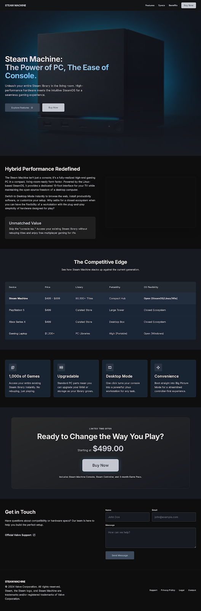

# Steam Machine — Página Web Estática

## Descripción General

**Steam Machine** es una página web estática de producto desarrollada como parte del curso de Desarrollo de Aplicaciones Web. El sitio presenta la consola Steam Machine de Valve Corporation, destacando sus características, especificaciones técnicas, beneficios y opciones de compra.

### Propósito

Informar y persuadir a potenciales compradores sobre las ventajas del Steam Machine frente a otras consolas del mercado, comunicando su propuesta de valor como un híbrido entre PC y consola.

### Público Objetivo

- Gamers con biblioteca de juegos en Steam que buscan una experiencia de sala de estar
- Usuarios interesados en hardware abierto y personalizable
- Personas que comparan alternativas a consolas tradicionales (PS5, Xbox Series X)

### Alcance

El sitio incluye las siguientes secciones:

- **Hero** — Presentación principal con imagen del producto
- **Description** — Descripción detallada del producto con especificaciones rápidas
- **Specs** — Tabla comparativa frente a la competencia
- **Benefits** — Beneficios clave del producto
- **Testimonials** — Opiniones de usuarios
- **Purchase** — Sección de compra con precio
- **Contact** — Formulario de contacto

---

## URL del Sitio Desplegado

[https://emilio-aldean.github.io/Emilio-Aldean-Desarrollo-de-Aplicaciones-web-Pagina-Estatica-Steam-Machine](https://emilio-aldean.github.io/Emilio-Aldean-Desarrollo-de-Aplicaciones-web-Pagina-Estatica-Steam-Machine)

---

## Captura de Pantalla

---

## Tecnologías Utilizadas

- HTML5
- Tailwind CSS (via CDN)
- Google Fonts — Inter
- Material Symbols (iconos)

---

## Autor

**Emilio Aldean**
Facultad de Ingeniería — Universidad de Especialidades Espíritu Santo (UEES)
Proyecto 01 — Desarrollo de Aplicaciones Web
